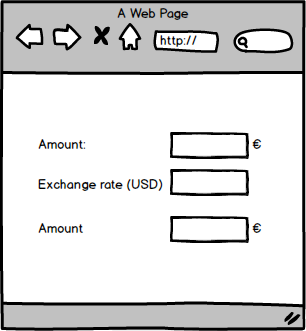
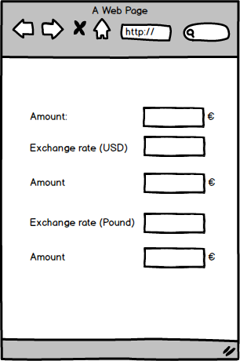

# Excercise

## Basic

Let's create an application that will display the current value in
Dollars and pounds from a given amount in Euros.

Tips to create this application:

- Take as starting point _01-hello-redux_
- Create two reducers:
  - On will hold the current amount of money the user owns (in euros).
  - Another will hold the exchange rate (dollars and pounds).
- Create a some selectors to calculate the exchanged amount.
- Create two components: - One will hold the input of information (total amount, current exchange).
  display the exchange. - The other will just display it.
- Create a Redux container to tied them up.

## Extra

Let's add a second currency convert it to
british pound.

