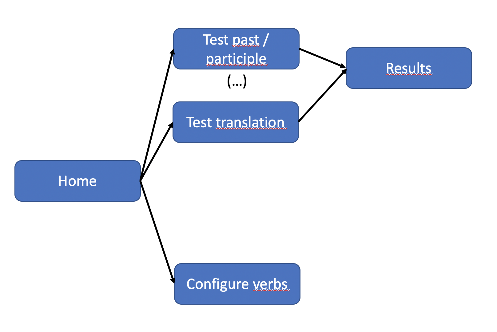
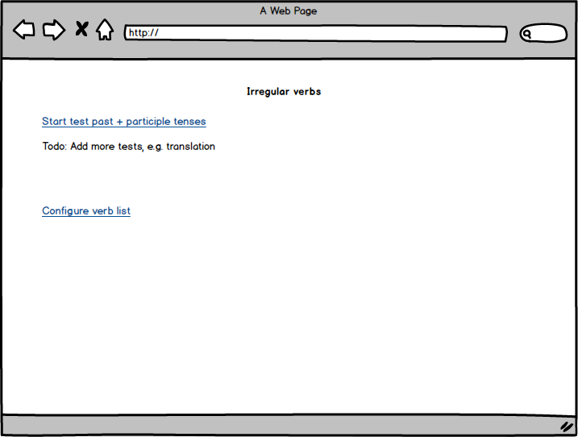
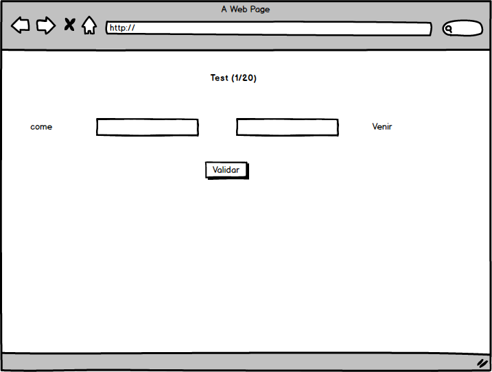
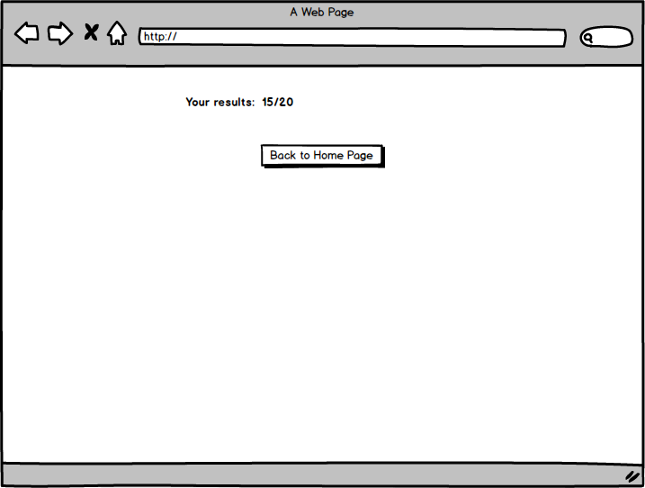
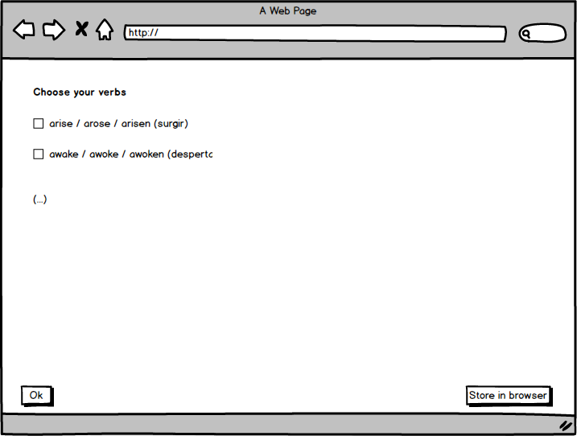

# Irregular Verbs excercise

Let's build a simple application:

- We will create several tests for students to practice and study irregular verbs.
- We will add an option for the users to personalize the list of verbs to be tested.

## Mocks

Application sitemap

Home page

Test A

Score

Verbs Config

## Basic Challenges

- How are we going to split the state, how many reducers do we need?

- Implement the verb configuration
page.

- Implement the test page.

- Implement the score results page.

## Extra Challenges

- Add a new test, verb => translation
- Let the user personaliza the number
of questions. 
